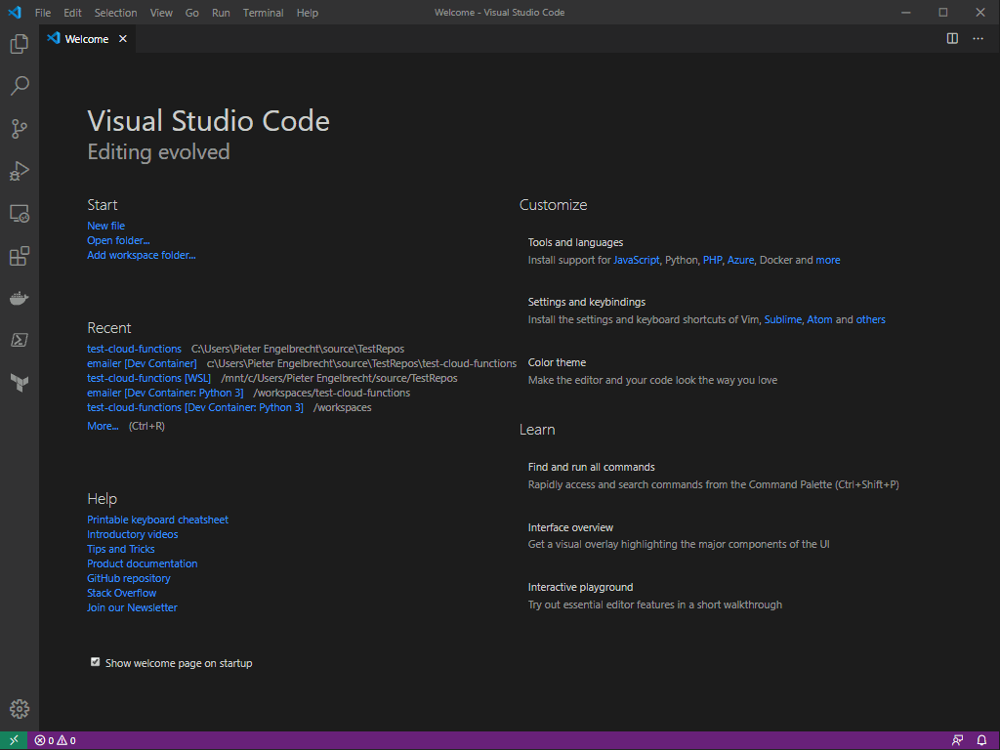

# test-cloud-functions
Just a repo to prototype the development process for cloud functions.

## Getting Started
Running the scripts in `_DevOps` will get your development environment setup. There is one for Windows that assumes [chocolatey](https://chocolatey.org/) is installed. The other is for Linux / WSL.

After this, open VSCode. Go to the remote window in the bottom left and choose `Remote Containers: Open Folder in Container`. Choose the cloud function you want to open from the browser. It will take a while to build a Docker container and start your development environment in it.

## During Development
All tests will appear in the test explorer on the left. <kbd>F5</kbd> starts the debugger, and will hold at any breakpoints.

Since Cloud Functions are actually triggered by events, one has to be created manually. This is were the `REST Client` extension comes into play. In each function's folder there is a `debug/*.rest` file(s) with some prefilled requests that the function can be tested against. Simple click `Send Request` at the top of each request to debug the function against that request. The plugin also has the <kbd>Ctrl</kbd> + <kbd>Alt</kbd> + <kbd>L</kbd> shortcut to repeat the last request.

Finally, linting and formatting of the source files happen automatically.

## Creating a new Cloud Function
To create a new cloud function, make a copy of the `_template` folder. Then give the folder the name of the function. Finally, see the `README.md` for more.

## Technical details
This local development relies on the [Remote - Containers](https://marketplace.visualstudio.com/items?itemName=ms-vscode-remote.remote-containers) VS Code extension. This extension creates a development environment in a Docker container and connects VS Code to the container. The file `.devcontainer/devcontainer.json` contains the config for this container's creation.

Currently, the folders cannot share a single Docker image. Therefore, each Cloud Function has its own container configuration for the time being. To not repeat common configurations, docker-compose is used in each configuration since docker-compose files can override each other. Thus, three sets exist in each configuration:

1. `docker-compose.yml` with config for the specific GFC. The parent folder of the first compose file determines the name of the created container. Hence, this entry should always be first in the configuration - else all the GCF will share the same container again.
1. `../../_container/docker-compose.yml` contains the common configuration across all the GCF development containers. It, thus, references the actual Docker file for each development image. This Docker file makes use of `ARG` to build a separate image for each GCF and the file in `1.` controls the `ARG`.
1. `../../_container/docker-compose.windows.yml` is just to mount the GCP credentials into the container on a Windows machine. The same mount should not take place for the Cloud Build, hence this separation into its own file.

The other files in `_container/` are to manage common resources from a single location. These files range from linter configs to command line aliases that initiate development tasks (like linting).

Other than this, it is usual VS Code business. Each GCF folder has a `.vscode` folder defining what should happen when <kbd>F5</kbd> is pressed - calling the `functions-framework` Python module for GCFs in the same manner it would have been called from the command line - and containing the definitions of the development environment.

### Cloud Builds
`_DevOps/` contains the Cloud Build configurations. Three sets exist:

1. `cloudbuild.image.yml` creates an image that is identical to the development image for each GCF. It, therefore, uses the same docker-compose files as the development environment, except that `docker-compose.windows.yml` is replaced with `docker-compose.cloud.yml` for Cloud Build specific configurations.
1. `cloudbuild.test.yml` uses the image in `1.` to check the formatting, linting, UT and IT for each PR.
1. `cloudbuild.deploy.yml` contains a single step to deploy the GCF.

All three configurations make use of `substitutions` allowing each GCF to adjust the configuration as needed. These `substitutions` are specified in the build triggers for each GCF. Thus, all the GCF use these shared configurations.